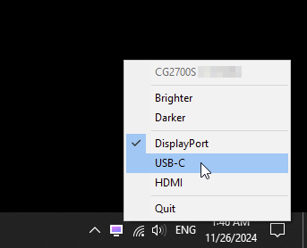
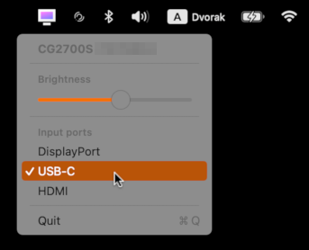

USB drivers
===========
:compact-option:
:source-highlighter: chroma

_usb-drivers_ is a collection of utilities to control various hardware over USB.

Utility overview
----------------

eizoctl
~~~~~~~
_eizoctl_ controls elementary settings of EIZO computer monitors, which do not
support DDC/CI.  Say no to oily stains on your monitor's frame!

 $ eizoctl --brightness +0.5 --input USB-C

It is intended as a replacement for official EIZO software,
and may not run at the same time, as it would contend for device access.

eizoctltray
~~~~~~~~~~~
_eizoctltray_ is a derived Windows/macOS utility that can stay in the systray.
When holding the Shift or Control keys while switching signal inputs,
it will also suspend or power off the system, respectively.




Installation
^^^^^^^^^^^^
On Windows, copy it to
__Users\*\AppData\Roaming\Microsoft\Windows\Start Menu\Programs\Startup__.

On macOS, copy it to the _Applications_ folder,
then add it in _System Settings → General → Login Items → Open at Login_.

Automation
^^^^^^^^^^
_eizoctltray_ can also be used the same way as _eizoctl_, just with any output
redirected to message windows, rather than a console window or a terminal.
This is useful for automation, such as with AutoHotkey.

Beware that Windows is not a fan of how rapidly EIZO monitors switch upstream
USB ports.  Thus, if you invoke port switching with keyboard shortcuts,
remember to add a small delay, so that pressed modifier keys are not remembered.
You will also want to silence any error messages.

.AutoHotkey example
```autohotkey
#Requires AutoHotkey v2.0
exe := A_Startup . "\eizoctltray.exe"
^#F1::  { ; Windows + Control + F1
	Sleep 500
	Run exe " -qq --input HDMI"
}
^#F2::  { ; Windows + Control + F2
	Sleep 500
	Run exe " -qq --input DP"
}
^#F3::  { ; Windows + Control + F3
	Sleep 500
	Run exe " -qq --input USB-C"
}
#Home:: { ; Windows + Home
	Run exe " -q --brightness +0.1"
}
#End::  { ; Windows + End
	Run exe " -q --brightness -0.1"
}
```

On macOS, the simplest way to bind keyboard shortcuts is the Shortcuts app,
with _Run Shell Scripts_ actions:

```
/Applications/eizoctltray.app/Contents/MacOS/eizoctltray -q --input HDMI
```

If you have issues with entering a specific key combination, like I did
with ^⌘F1 etc., try changing it later within _System Settings_ → _Keyboard_ →
_Keyboard Shortcuts..._ → _Services_ → _Shortcuts_.

elksmart-comm
~~~~~~~~~~~~~
_elksmart-comm_ interfaces with ELK Smart infrared dongles EKX4S and EKX5S-T,
partially reimplementing the Ocrustar mobile app.  It can both receive and send,
although the older dongle is extremely unreliable at receiving.

To mimic the Nikon ML-L3 infrared wireless remote control:

 $ elksmart-comm 80ffffffffffffc71c5f1bda1bffffffffffffffffffffffffffffff3a7bffffffffffff99185f1bda1b03

While it does not build for Windows, this is incidental.

razer-bw-te-ctl
~~~~~~~~~~~~~~~
_razer-bw-te-ctl_ makes it possible to change the configuration of your Razer
BlackWidow Tournament Edition keybooard (the 2012 model).

Make sure to let the Windows Razer Synapse tool upgrade the firmware to the
newest version before running the program.  There might be some issues otherwise
due to protocol changes, although I don't really deem it very probable.

Packages
--------
Regular releases are sporadic.  git master should be stable enough.
You can get a package with the latest development version
as a https://git.janouch.name/p/nixexprs[Nix derivation].

Windows/macOS binaries can be downloaded from
https://git.janouch.name/p/usb-drivers/releases[the Releases page on Gitea].

Building
--------
Build dependencies:
 CMake, pkg-config, liberty (included) +
Runtime dependencies:
 libusb-1.0 (elksmart-comm, razer-bw-te-ctl), hidapi >= 0.14 (eizoctl)

 $ git clone --recursive https://git.janouch.name/p/usb-drivers.git
 $ mkdir usb-drivers/build
 $ cd usb-drivers/build
 $ cmake .. -DCMAKE_INSTALL_PREFIX=/usr -DCMAKE_BUILD_TYPE=Debug
 $ make

To install the applications, you can do either the usual:

 # make install

Or you can try telling CMake to make a package for you.  For Debian it is:

 $ cpack -G DEB
 # dpkg -i usb-drivers-*.deb

Windows
~~~~~~~
You can either build within an MSYS2 environment,
or cross-compile using Mingw-w64:

 $ sh -e cmake/Win64Depends.sh
 $ cmake -DCMAKE_TOOLCHAIN_FILE=liberty/cmake/toolchains/MinGW-w64-x64.cmake \
   -DCMAKE_BUILD_TYPE=Release -B build
 $ cmake --build build

macOS
~~~~~
You can either build _eizoctltray_ against Homebrew,
or link hidapi statically for a standalone portable app:

 $ git clone https://github.com/libusb/hidapi.git
 $ cmake -S hidapi -DBUILD_SHARED_LIBS=OFF \
   -DCMAKE_INSTALL_PREFIX=$PWD/hidapi-build \
   -DCMAKE_BUILD_TYPE=Release -B hidapi-build
 $ cmake --build hidapi-build -- install
 $ cmake -Dhidapi_ROOT=$PWD/hidapi-build -DCMAKE_BUILD_TYPE=Release -B build
 $ cmake --build build

Contributing and Support
------------------------
Use https://git.janouch.name/p/usb-drivers to report bugs, request features,
or submit pull requests.  `git send-email` is tolerated.  If you want to discuss
the project, feel free to join me at ircs://irc.janouch.name, channel #dev.

Bitcoin donations are accepted at: 12r5uEWEgcHC46xd64tt3hHt9EUvYYDHe9

License
-------
This software is released under the terms of the 0BSD license, the text of which
is included within the package along with the list of authors.
